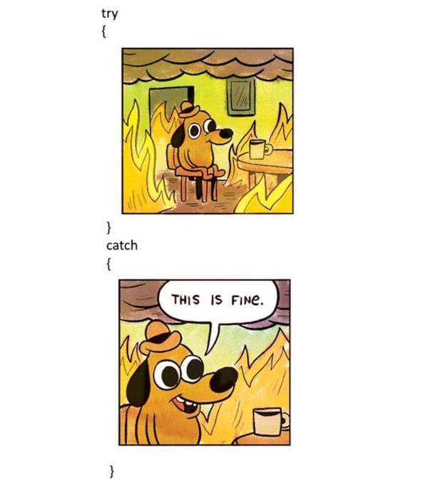

# 10 anti patterns

1.  **上帝物件 (God Object)：**
* 问题：单一类别承担过多责任，违反单一职责原则 (SRP)。
  * 解决方案：拆分职责，使用设计模式 (Facade, Strategy, Command)。

2.  **硬编码数值 (Hardcoding Values)：**
* 问题：程式码缺乏弹性，难以维护。
  * 解决方案：使用设定档 (JSON, XML)，依赖注入 (DI)。

3.  **紧密耦合 (Tightly Coupled Code)：**
* 问题：类别之间过度依赖，导致系统脆弱。
  * 解决方案：遵循依赖反转原则 (DIP)，使用 DI，实作松散耦合 (事件、委派、Observer、Mediator)。

4.  **过度使用静态类别 (Overusing Static Classes)：**
* 问题：难以测试和扩展。
  * 解决方案：使用 DI 注入服务，谨慎使用 Singleton。

5.  **忽略例外处理 (Ignoring Exception Handling)：**
* 问题：应用程式可能崩溃或泄露敏感资讯。
  * 解决方案：捕获特定例外，使用全域例外处理，记录错误。

6.  **过早最佳化 (Premature Optimization)：**
* 问题：浪费时间，增加程式码复杂性。
  * 解决方案：先写清晰易懂的程式码，使用效能分析工具，之后再针对瓶颈进行优化。

7.  **复制贴上程式码 (Copy-Pasting Code)：**
* 问题：程式码冗余，增加维护难度和错误风险。
  * 解决方案：遵循 DRY 原则，定期重构。

8.  **误用执行绪 (Misusing Threads)：**
* 问题：导致资源竞争、死锁、行为不可预测。
  * 解决方案：使用非同步程式设计 (async/await, Task)，使用平行程式库 (TPL, PLINQ)，避免死锁。

9.  **忽略单元测试 (Neglecting Unit Tests)：**
* 问题：程式码脆弱，难以修改。
  * 解决方案：编写单元测试 (xUnit, NUnit, MSTest)，使用模拟 (Moq, NSubstitute)，遵循 TDD。

10. **过度设计 (Over-Engineering)：**
* 问题：增加不必要的复杂性。
  * 解决方案：遵循 YAGNI 原则，从简单的解决方案开始，定期审查设计决策。
